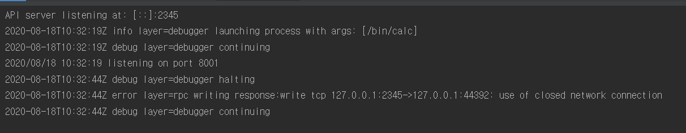

# calc

## 필수사항
    Goland 2020.2 이상 (아닐 경우 아래와 같은 버그 발생)



참고: https://blog.jetbrains.com/go/2019/02/06/debugging-with-goland-getting-started/


<br />
<br />
<br />
<br />

## 테스트 방법
1. docker-compose 로 docker container 실행
2. go Remote 설정 (localhost:2345) 후 디버깅 모드 실행
3. `curl`을 사용하여 서버에 요청 테스트 
```go
curl 'localhost:8001/fib?num=1000'
```